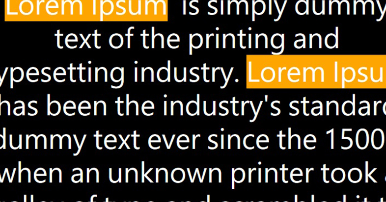

平時我哋讀書個時都會用到瑩光筆去畫起一啲重點，方便以後搵翻啲重點出嚟。嚟到 WPF 嘅世界我哋又點先可以做到瑩光筆嘅效果呢，以下有幾個方法：

`TextBlock` 入面夾大量嘅 `Run`, 而每一個中咗嘅 `Run` 嘅 `Background` 就會變成黃色。
`WrapPanel` 作為 Parent，中間 Render 大量 `TextBlock`，當 `TextBlock` 入面嘅字中左就會變成黃色。
`RichTextBox` + `Paragraph`
講多無謂，實戰下先。

假設我地有 100 段 `Paragraph` (即係下面條 `string`)，我哋要 highlight 個 i 字。
```csharp
string text = "Lorem ipsum dolor sit amet, consectetur adipiscing elit ... ullamcorper pulvinar tellus.";
Regex keywordMatchingRegex = new Regex("i", RegexOptions.IgnoreCase);
```

用我哋上面所寫嘅方法去 Render 可以得出以下嘅 Code

(1) `TextBlock` 夾 `Run`
```csharp
TextBlock textBlock = new TextBlock();
 
int lastPt = 0;
List<Run> listOfRun = new List<Run>();
 
while (keywordMatchingRegex.Length > 0) {
    listOfRun.Add(new Run() {
        Text = text.SubString(lastPt, keywordMatchingRegex.Index - keywordMatchingRegex.Length),
    });
 
    listOfRun.Add(new Run() {
        Text = keywordMatchingRegex.Value,
        Background = new SolidColorBrush(Colors.Yellow),    
    });
 
    lastPt = keywordMatchingRegex.Index + keywordMatchingRegex.Length;
    keywordMatchingRegex = keywordMatchingRegex.Next();
}
 
listOfRun.Add(new Run() {
    Text = text.SubString(lastPt),
});
 
textBlock.Inlines.Clear();
textBlock.Inlines.AddRange(listOfRun);
```

(2) `WrapPanel` 夾 `TextBlock`
```csharp
WrapPanel wrapPanel = new WrapPanel()
{
    Orientation = Orientation.Horizontal
};
 
while (keywordMatchingRegex.Length > 0) {
    wrapPanel.Children.Add(new TextBlock()
    {
        Text = unmatchedText,
    });
 
    wrapPanel.Children.Add(new TextBlock() {
        Text = keywordMatchingRegex.Value,
        Background = new SolidColorBrush(Colors.Yellow),    
    });
 
    lastPt = keywordMatchingRegex.Index + keywordMatchingRegex.Length;
    keywordMatchingRegex = keywordMatchingRegex.Next();
}
 
wrapPanel.Children.Add(new TextBlock() {
    Text = text.SubString(lastPt),
});
```

(3) `RichTextBox` 夾 `Paragraph` 夾 `Run`
```csharp
RichTextBox richTextBox = new RichTextBox();
Paragraph p = new Paragraph();
 
while (keywordMatchingRegex.Length > 0) {
    p.Inlines.Add(new Run()
    {
        Text = unmatchedText,
    });
 
    p.Inlines.Add(new Run() {
        Text = keywordMatchingRegex.Value,
        Background = new SolidColorBrush(Colors.Yellow),    
    });
 
    lastPt = keywordMatchingRegex.Index + keywordMatchingRegex.Length;
    keywordMatchingRegex = keywordMatchingRegex.Next();
}
 
p.Inlines.Add(new Run() {
    Text = text.SubString(lastPt),
});
 
richTextBox.Document.Blocks.Add(p);
```

其實三個方法表面上都好似，只係用上唔同既 `UI-Element` Display 出黎，但 Performance 上可以話係差天共地！我地可以睇下下面嘅 benchmark result．

||TextBlock + Run|WrapPanel + TextBlock|RichTextBox + Paragraph|
|---|---|---|---|
|Elapsed Time (ms)|564|707|382|

從以上嘅數據可以睇得出 `RichTextBox` 喺 Performance 上面真係完全佔優！