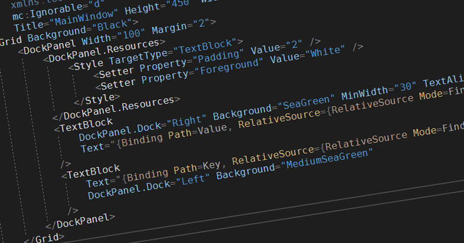

今日黎試下 WPF 嘅 Data Binding Performance

跟據 Microsoft 喺 Developer Guide 入面寫過 Data Binding 需要留意以下幾點:

1. 當需要大量 `Data Binding` 嘅時候，1000 個 Single Property Object 會快過 1 個 1000 Properties 嘅 Object
2. `ItemsSource` 用 `ObservableCollection` 會比 `IEnumerable` 好

### 大量 Data Binding 嘅處理
以下有一個 C# Object
```csharp
public class ThousandsStringViewModel {
  public string Property1 { get; set; }
  public string Property2 { get; set; }
  public string Property3 { get; set; }
  ...
  public string Property1000 { get; set; }
}
```
上面嘅 Object 就直接打晒 1000 個 Properties 出黎, 跟據 Microsoft 嘅講法呢個 Structure 係會比較慢架

以下就有一個 Single Property Object
```csharp
public class ValueBase<T> {
  public string Value { get; set; }
}
```

之後就係 ViewModel 入面建立番 1000 個同樣既 Single Property Object
```csharp
public class ThousandsValueBaseViewModel {
  public ValueBase<string> Property1 { get; private set; }
  public ValueBase<string> Property2 { get; private set; }
  public ValueBase<string> Property3 { get; private set; }
  ...
  public ValueBase<string> Property1000 { get; private set; }
}
```

||String Base|Value Base|
|---|---|---|
|Trial 1|42|36|
|Trial 2|48|38|
|Trial 3|52|41|
|Trial 4|46|33|
|Trial 5|37|38|
|Avg.|45|37.2|

從以上數據所得, Single Property Object 係 render time 上面的確比較快