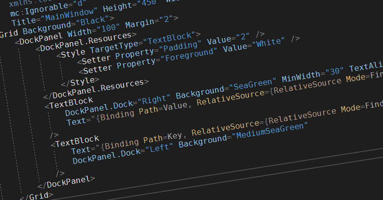

有時為左簡化 Binding Process, 有需要放條 Binding Path 係 ViewModel 入面。執 Binding Path 嘅 Process 極為複雜，要對著個 Object 打番條 Path 出黎出錯機會極高。過一排要更改更加係一個地獄。

有冇唔洗咁傻仔既方法，唔洗下下都要對著個 Object Path 打番晒出黎，仲可以係有錯既時候提你呢？

最好嘅方法就係直接 Create 個 `Object` 然後用 `dot` `dot` `dot` 跳入去你目標既 `Variable`

(1) 執 Path 好幫手 GetPath(Expression<Func<object>> action)
```csharp
public static string GetPath(Expression<Func<object>> action)
{
  string path = action.Body.ToString();
  string originalObj = path.Split('.')[0];

  if (path.StartsWith("Convert"))
  {
    // Remove ")" at the end of the expression
    path = path.Remove(path.Length - 1, 1);
  }

  return path.Remove(0, originalObj.Length + 1);
}
```

(2) Call GetPath
```csharp
GetPath(() => new Reactangle().Width.Value)
```

上面既 Fuction (1) 用上 `LINQ Expression`，Create 一個 `Expression` 指去你要既 `Variable`。當 Pass 個 `Expression` 入去 `GetPath` 嘅時候 , `action.Body.ToString()` 就會識得 `return` 到 `new Rectangle().Width.Value`，咁就唔洗下下都自己打條 `String Path` 出黎！當個 `Object` 有更改既時候 IDE 自身都會提你條 `Path` 需要 `Update` 喇。

而最正既係呢條 LINQ Expression 根本唔會 execute，只會佔用 Memory，因此唔會增加你既 execution time。但係 Memory 方面依然會受到影響。