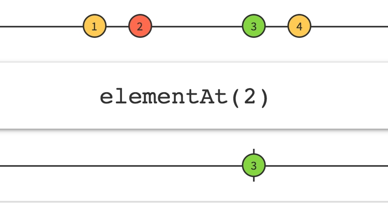

假設依家有一個 `Dictionary`, 我地想係入面 `get` 某一個 `index` 既 `element` 出黎

由於 Dictionary 本身唔係一個有 Index 既 Data Structure, 唔可以直接拎個 item 出黎

呢個情況底下我地有幾個選擇

1. 直接行一個Loop, Loop 到第 N 個 Element 就 return 佢出黎
```csharp
int i = 0;
foreach (KeyValuePair<K, V> pair in Dictionary) {
  if (i < index) {
    i ++
  } else {
    return pair.Value;
  }
}
```

2. 用 `LINQ` 既 `ElementAt` 執個 Element 出黎
```csharp
return Dictionary.Values.ElementAt(index);
```

3. 直接 Convert Dictionary.Values 做一條 List 然後再 Get 出黎
```csharp
List<V> listOfValues = Dictionay.Values.ToList();
return listOfValues[index];
```

### 講多無謂 數字最實際
依家我地會 Create 一個有 100,000 隻 item 既 Dictionary, 然後用上面既方法搵番第 N 個 element出黎

|Method|Elapsed Time|
|---|---|---|
|for-loop|31190ms|
|ElementAt|31712ms|
|Converted List|2ms|

癡線! 連埋 Dictionay.Values.ToList() 都係2ms! 就咁睇都知應該要用邊個! 不過用 Converted List 就會用多左 Memory 喇


