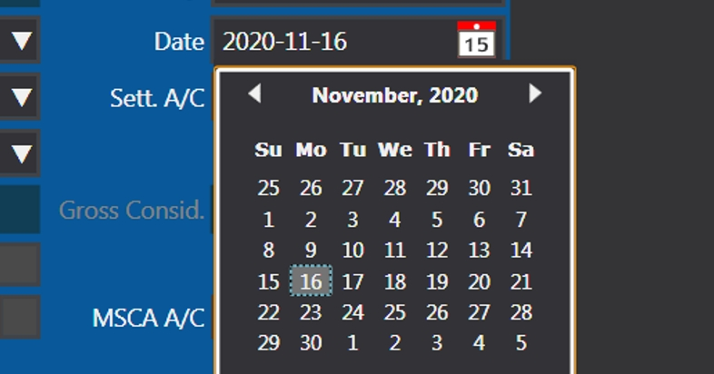

`DatePicker` 有個 `HeaderButton` display 你揀左既年+月

但成日我用緊英文個時佢會 display 做 2020年11月 而唔係 November 2020

所以要用 `CurrentCulture` 強行改佢做英文

```csharp
Thread.CurrentThread.CurrentCulture = new CultureInfo("en-US");
Thread.CurrentThread.CurrentUICulture = new CultureInfo("en-US");
```


